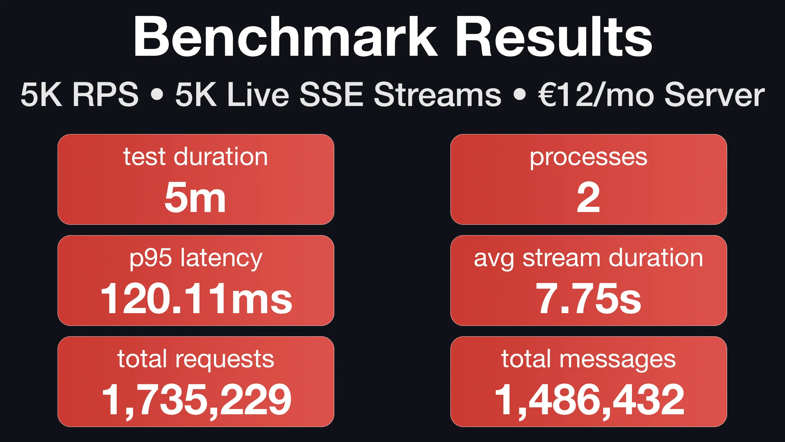

import ExternalLink from "@site/src/components/ExternalLink"

Ran a benchmark to test SSE performance under sustained load. Two workers on a €12/month CCX13 Hetzner server handling 5K RPS to a SQLite-backed endpoint plus 5K concurrent SSE streams.

<!-- truncate -->

The setup:
- 5K requests per second to an endpoint querying SQLite
- 5K simultaneous SSE streams (5-10 seconds each, one message per second)
- Streams replaced immediately on close to maintain constant 5K connections
- Two Rage processes
- 5 minute test duration

Results:
- **120ms** p95 latency
- **7.75s** average stream duration
- **1,735,229** requests processed
- **1,486,432** SSE messages sent
- **0** errors

  

The CCX13 server handles ~11K RPS to the SQLite endpoint without any streams. Adding 5K concurrent streams cuts throughput roughly in half instead of collapsing it - the fiber model handles I/O multiplexing the way it's supposed to, and scaling looks linear.

<ExternalLink
    title="SSE Benchmark Repository"
    to="https://github.com/rage-rb/sse-benchmark"
/>
